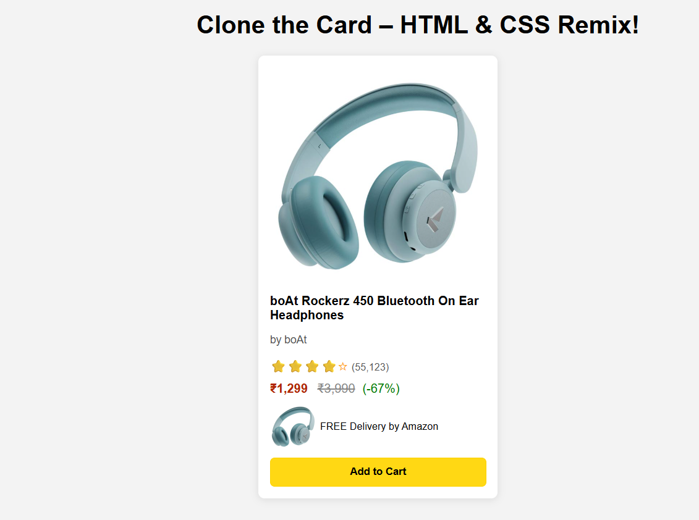

# 🛍️ Amazon Product Card Clone

Recreation of an Amazon-style product card using **pure HTML & CSS**. This mini project replicates the look and feel of a typical product listing on Amazon — no JavaScript or frameworks involved.

## ✨ Features

- ✅ Clean and responsive product layout
- ⭐ Star-based rating system
- 💰 Modern price display with discount
- 🚚 Amazon Prime delivery badge
- 🛒 Add to Cart button with hover effect

## 📸 Screenshots

### Desktop View



### Mobile View


## 🧩 Tech Stack

| Tech | Usage |
|------|-------|
| HTML5 | Structure |
| CSS3  | Styling & layout |

## 🚀 Getting Started

### 1. Clone the repository

```bash
git clone https://github.com/your-username/amazon-card-clone.git
cd amazon-card-clone
